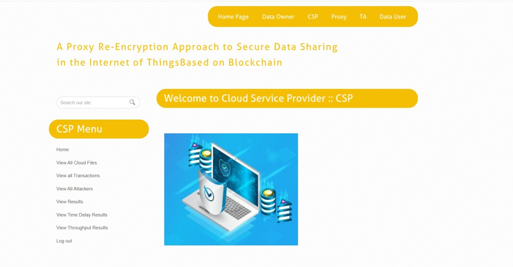
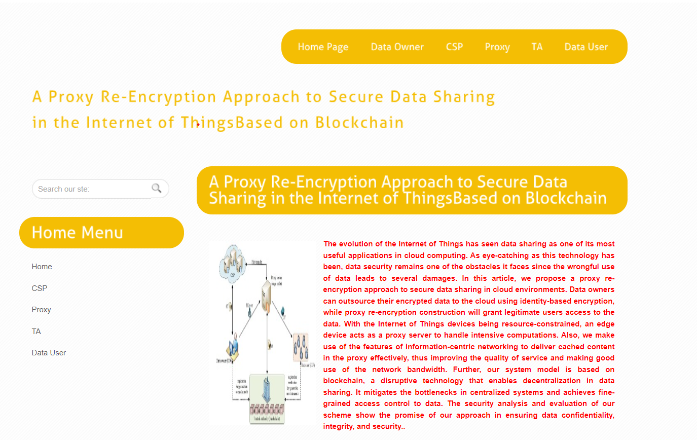
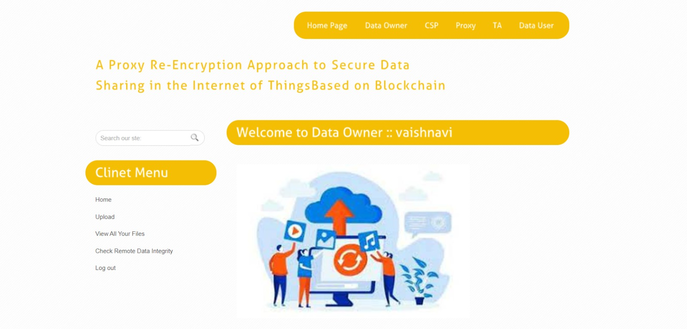
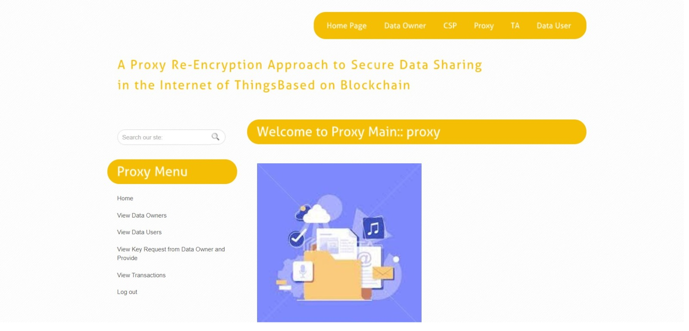
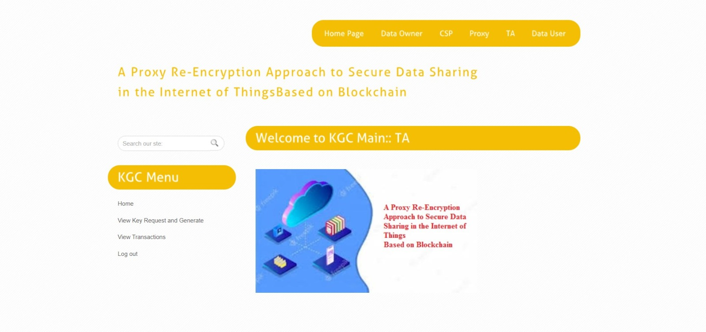
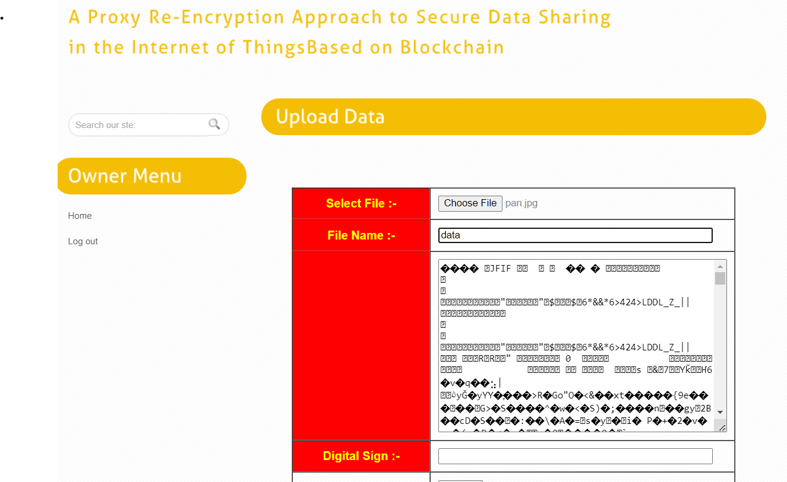
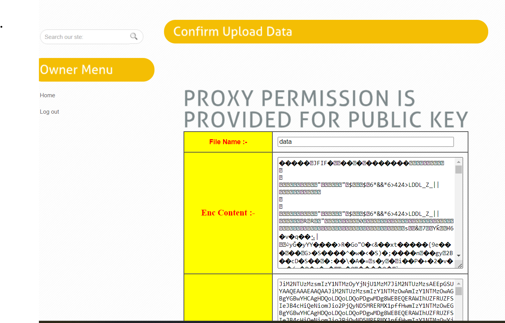

# proxy-reencryption-iot-blockchain
A proxy re-encryption approach to secure data sharing in the Internet of Things (IoT) using blockchain technology. This project ensures secure, decentralized, and authorized data access between data owners and users.

## Project Screenshots

### CSP Module  

### Home Page  

### Owner Module  

### Proxy Module  

### TA Module  

### Upload First  

### Uploaded Data  

